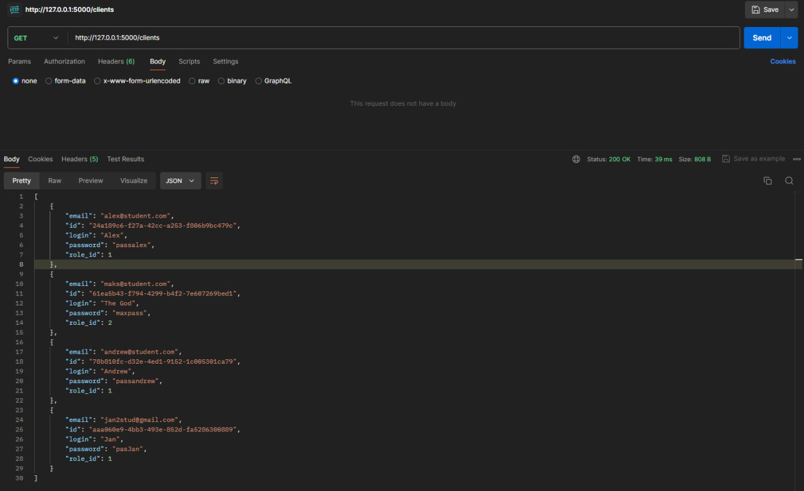

# Тестування працездатності системи

## Тестування RESTfull API через запити HTTTP

### GET

  

### PUT

  

#### Перевірка за допомогою метода GET

  

### POST

  

#### Перевірка за допомогою метода GET

  

### DELETE

  

#### Перевірка за допомогою метода GET

  

